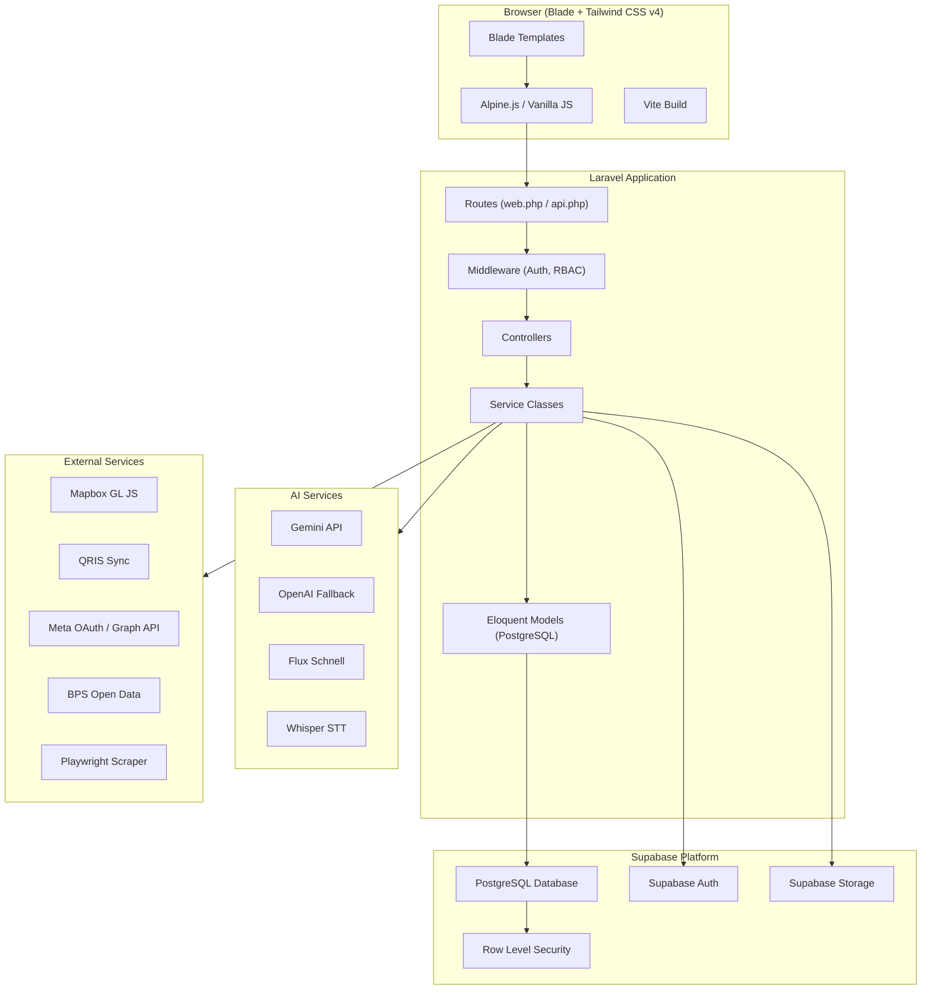
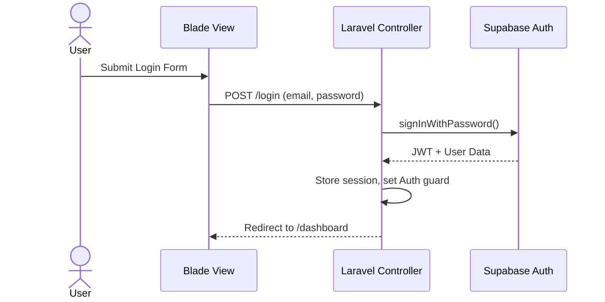
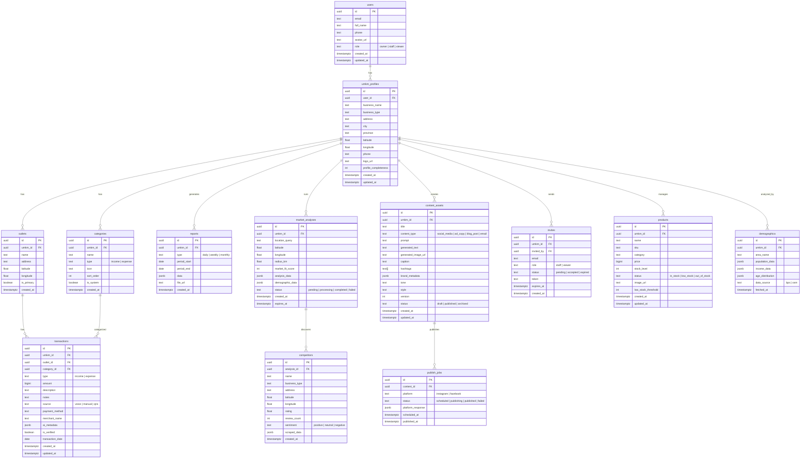

# SiJual — Implementation Plan

## 1. Arsitektur Sistem

### 1.1 Pola Integrasi Laravel + Supabase



### 1.2 Koneksi Laravel ↔ Supabase

Laravel terhubung ke Supabase PostgreSQL melalui **Eloquent ORM** dengan konfigurasi `DATABASE_URL` (Session Pooler connection string). Pendekatan ini memungkinkan:

- **Eloquent Models** → langsung query tabel Supabase PostgreSQL
- **Laravel Migrations** → TIDAK digunakan untuk DDL (tabel dibuat via Supabase SQL Editor / migration SQL files)
- **Supabase Auth** → diintegrasikan via `supabase-php` SDK atau REST API untuk JWT verification
- **Supabase Storage** → diakses via REST API / SDK untuk upload gambar/file
- **RLS (Row Level Security)** → dikonfigurasi di Supabase untuk security tambahan di level database

```php
// .env configuration
DB_CONNECTION=pgsql
DB_HOST=xxxx.pooler.supabase.com
DB_PORT=5432
DB_DATABASE=postgres
DB_USERNAME=postgres.xxxx
DB_PASSWORD=your-database-password

SUPABASE_URL=https://xxxx.supabase.co
SUPABASE_KEY=your-anon-key
SUPABASE_SERVICE_KEY=your-service-role-key
```

### 1.3 Authentication Flow



---

## 2. Skema Database & Tabel (Supabase PostgreSQL)

### 2.1 Entity Relationship Diagram



### 2.2 RLS (Row Level Security) Policies

Setiap tabel yang berisi data tenant harus memiliki RLS:

```sql
-- Contoh policy untuk transactions
ALTER TABLE transactions ENABLE ROW LEVEL SECURITY;

CREATE POLICY "Users can view own UMKM transactions"
  ON transactions FOR SELECT
  USING (
    umkm_id IN (
      SELECT id FROM umkm_profiles WHERE user_id = auth.uid()
    )
  );

CREATE POLICY "Users can insert own UMKM transactions"
  ON transactions FOR INSERT
  WITH CHECK (
    umkm_id IN (
      SELECT id FROM umkm_profiles WHERE user_id = auth.uid()
    )
  );

CREATE POLICY "Users can update own UMKM transactions"
  ON transactions FOR UPDATE
  USING (
    umkm_id IN (
      SELECT id FROM umkm_profiles WHERE user_id = auth.uid()
    )
  );
```

### 2.3 SQL Migration Files (Supabase)

Migration files akan dibuat sebagai `.sql` files di `database/supabase/`:

```
database/supabase/
├── 001_create_users_table.sql
├── 002_create_umkm_profiles_table.sql
├── 003_create_outlets_table.sql
├── 004_create_categories_table.sql
├── 005_create_transactions_table.sql
├── 006_create_reports_table.sql
├── 007_create_market_analyses_table.sql
├── 008_create_competitors_table.sql
├── 009_create_demographics_table.sql
├── 010_create_content_assets_table.sql
├── 011_create_publish_jobs_table.sql
├── 012_create_invites_table.sql
├── 013_create_products_table.sql
├── 014_create_indexes.sql
├── 015_create_rls_policies.sql
└── 016_seed_default_categories.sql
```

---

## 3. Struktur Folder Proyek

```
sijual/
├── app/
│   ├── Http/
│   │   ├── Controllers/
│   │   │   ├── Auth/
│   │   │   │   ├── LoginController.php
│   │   │   │   ├── RegisterController.php
│   │   │   │   ├── ForgotPasswordController.php
│   │   │   │   └── GoogleAuthController.php
│   │   │   ├── Dashboard/
│   │   │   │   └── HubController.php
│   │   │   ├── SiKas/
│   │   │   │   ├── DashboardController.php
│   │   │   │   ├── TransactionController.php
│   │   │   │   ├── ReportController.php
│   │   │   │   ├── VoiceInputController.php
│   │   │   │   └── QrisSyncController.php
│   │   │   ├── SiPasar/
│   │   │   │   ├── AnalysisController.php
│   │   │   │   ├── CompetitorController.php
│   │   │   │   ├── DemographicController.php
│   │   │   │   └── MapController.php
│   │   │   ├── SiPromo/
│   │   │   │   ├── ContentController.php
│   │   │   │   ├── GenerateController.php
│   │   │   │   ├── PublishController.php
│   │   │   │   └── TemplateController.php
│   │   │   ├── SiStok/
│   │   │   │   └── ProductController.php
│   │   │   ├── Profile/
│   │   │   │   ├── ProfileController.php
│   │   │   │   └── OutletController.php
│   │   │   └── Copilot/
│   │   │       └── CopilotController.php
│   │   ├── Middleware/
│   │   │   ├── SupabaseAuth.php
│   │   │   ├── EnsureProfileComplete.php
│   │   │   └── CheckRole.php
│   │   └── Requests/
│   │       ├── TransactionRequest.php
│   │       ├── ProfileRequest.php
│   │       ├── ContentRequest.php
│   │       └── AnalysisRequest.php
│   ├── Models/
│   │   ├── User.php
│   │   ├── UmkmProfile.php
│   │   ├── Outlet.php
│   │   ├── Category.php
│   │   ├── Transaction.php
│   │   ├── Report.php
│   │   ├── MarketAnalysis.php
│   │   ├── Competitor.php
│   │   ├── Demographic.php
│   │   ├── ContentAsset.php
│   │   ├── PublishJob.php
│   │   ├── Invite.php
│   │   └── Product.php
│   ├── Services/
│   │   ├── Supabase/
│   │   │   ├── SupabaseAuthService.php
│   │   │   └── SupabaseStorageService.php
│   │   ├── AI/
│   │   │   ├── GeminiService.php
│   │   │   ├── OpenAIFallbackService.php
│   │   │   ├── WhisperSTTService.php
│   │   │   ├── FluxSchnellService.php
│   │   │   ├── TransactionCategorizerService.php
│   │   │   ├── FinancialInsightService.php
│   │   │   ├── CaptionGeneratorService.php
│   │   │   ├── BrandGuardService.php
│   │   │   ├── MarketFitScoreService.php
│   │   │   ├── SentimentTaggingService.php
│   │   │   ├── TrendDetectionService.php
│   │   │   └── CopilotService.php
│   │   ├── Report/
│   │   │   ├── ReportAggregationService.php
│   │   │   └── ExportService.php
│   │   ├── Market/
│   │   │   ├── CompetitorScraperService.php
│   │   │   ├── BPSDataService.php
│   │   │   ├── GeospatialService.php
│   │   │   └── AnalysisCacheService.php
│   │   ├── Payment/
│   │   │   └── QrisSyncService.php
│   │   └── Social/
│   │       ├── MetaOAuthService.php
│   │       └── PublishSchedulerService.php
│   └── View/
│       └── Components/
│           ├── Layout/
│           │   ├── AppLayout.php
│           │   ├── GuestLayout.php
│           │   └── MobileLayout.php
│           ├── Navigation/
│           │   ├── SideNavBar.php
│           │   ├── TopAppBar.php
│           │   └── BottomNavBar.php
│           └── UI/
│               ├── StatCard.php
│               ├── TransactionListItem.php
│               ├── MarketAlertCard.php
│               ├── FilterChip.php
│               └── ContentPreviewCard.php
├── resources/
│   ├── views/
│   │   ├── layouts/
│   │   │   ├── app.blade.php            # Main authenticated layout (sidebar + topbar)
│   │   │   ├── guest.blade.php          # Login/register layout
│   │   │   └── mobile.blade.php         # Mobile layout with bottom nav
│   │   ├── components/
│   │   │   ├── navigation/
│   │   │   │   ├── side-nav-bar.blade.php
│   │   │   │   ├── top-app-bar.blade.php
│   │   │   │   └── bottom-nav-bar.blade.php
│   │   │   ├── ui/
│   │   │   │   ├── stat-card.blade.php
│   │   │   │   ├── transaction-list-item.blade.php
│   │   │   │   ├── transaction-detail.blade.php
│   │   │   │   ├── market-alert-card.blade.php
│   │   │   │   ├── filter-chip.blade.php
│   │   │   │   ├── voice-input-bar.blade.php
│   │   │   │   ├── revenue-chart.blade.php
│   │   │   │   ├── market-fit-score-card.blade.php
│   │   │   │   ├── content-preview-card.blade.php
│   │   │   │   ├── product-table.blade.php
│   │   │   │   └── copilot-bar.blade.php
│   │   │   └── form/
│   │   │       ├── input.blade.php
│   │   │       ├── select.blade.php
│   │   │       ├── textarea.blade.php
│   │   │       └── button.blade.php
│   │   ├── auth/
│   │   │   ├── login.blade.php          # Figma: 2:2 (Desktop) + 2:573 (Mobile)
│   │   │   ├── register.blade.php       # Figma: 2:269
│   │   │   └── forgot-password.blade.php
│   │   ├── onboarding/
│   │   │   └── profile-setup.blade.php  # Figma: 2:416
│   │   ├── hub/
│   │   │   └── dashboard.blade.php      # Figma: 2:58 (Desktop) + 2:1338 (Mobile)
│   │   ├── sikas/
│   │   │   ├── dashboard.blade.php      # Figma: 2:922 (Desktop) + 2:416 (Mobile)
│   │   │   ├── transactions.blade.php   # Figma: 2:1443
│   │   │   └── reports.blade.php        # Figma: 2:1767
│   │   ├── sipasar/
│   │   │   ├── landing.blade.php        # Figma: 2:1184
│   │   │   ├── analysis.blade.php       # Figma: 2:837 (Mobile)
│   │   │   └── results.blade.php
│   │   ├── sipromo/
│   │   │   ├── landing.blade.php        # Figma: 2:2069
│   │   │   ├── generate.blade.php       # Figma: 2:2251
│   │   │   ├── preview.blade.php        # Figma: 2:2561
│   │   │   └── history.blade.php
│   │   ├── sistok/
│   │   │   └── index.blade.php          # Figma: 2:1767
│   │   ├── profile/
│   │   │   └── edit.blade.php
│   │   └── settings/
│   │       └── index.blade.php
│   ├── css/
│   │   └── app.css                      # Tailwind CSS v4 imports + design tokens
│   └── js/
│       ├── app.js                       # Main entry
│       ├── alpine/                      # Alpine.js components
│       │   ├── voice-input.js
│       │   ├── chart.js
│       │   ├── map.js
│       │   └── copilot.js
│       └── utils/
│           ├── supabase-client.js       # Client-side Supabase for realtime
│           └── format.js                # Currency, date formatters
├── routes/
│   ├── web.php                          # All web routes
│   └── api.php                          # API routes for AJAX/JS calls
├── database/
│   ├── supabase/                        # SQL migration files for Supabase
│   └── seeders/
├── config/
│   ├── supabase.php                     # Supabase config values
│   └── ai.php                           # AI service config
├── public/
│   ├── images/
│   └── build/
├── tests/
│   ├── Feature/
│   └── Unit/
├── vite.config.js
├── tailwind.config.js                   # Tailwind v4 (or CSS-first config)
├── composer.json
├── package.json
└── .env
```

---

## 4. Routing Utama

```php
// routes/web.php

// === GUEST ROUTES ===
Route::middleware('guest')->group(function () {
    Route::get('/', fn() => redirect('/login'));
    Route::get('/login', [LoginController::class, 'show'])->name('login');
    Route::post('/login', [LoginController::class, 'store']);
    Route::get('/register', [RegisterController::class, 'show'])->name('register');
    Route::post('/register', [RegisterController::class, 'store']);
    Route::get('/forgot-password', [ForgotPasswordController::class, 'show'])->name('password.request');
    Route::post('/forgot-password', [ForgotPasswordController::class, 'store']);
    Route::get('/auth/google', [GoogleAuthController::class, 'redirect'])->name('auth.google');
    Route::get('/auth/google/callback', [GoogleAuthController::class, 'callback']);
});

// === AUTHENTICATED ROUTES ===
Route::middleware(['auth:supabase'])->group(function () {

    // Onboarding
    Route::get('/onboarding', [ProfileController::class, 'onboarding'])->name('onboarding');
    Route::post('/onboarding', [ProfileController::class, 'completeOnboarding']);

    // Protected routes (profile must be complete)
    Route::middleware(['profile.complete'])->group(function () {

        // SiJual Hub (Dashboard)
        Route::get('/dashboard', [HubController::class, 'index'])->name('dashboard');

        // SiKas
        Route::prefix('sikas')->name('sikas.')->group(function () {
            Route::get('/', [SiKas\DashboardController::class, 'index'])->name('dashboard');
            Route::resource('transactions', SiKas\TransactionController::class);
            Route::get('/reports', [SiKas\ReportController::class, 'index'])->name('reports');
            Route::post('/reports/export', [SiKas\ReportController::class, 'export'])->name('reports.export');
            Route::post('/voice-input', [SiKas\VoiceInputController::class, 'process'])->name('voice');
            Route::post('/qris-sync', [SiKas\QrisSyncController::class, 'sync'])->name('qris.sync');
        });

        // SiPasar
        Route::prefix('sipasar')->name('sipasar.')->group(function () {
            Route::get('/', [SiPasar\AnalysisController::class, 'index'])->name('landing');
            Route::post('/analyze', [SiPasar\AnalysisController::class, 'analyze'])->name('analyze');
            Route::get('/results/{analysis}', [SiPasar\AnalysisController::class, 'results'])->name('results');
            Route::get('/competitors/{analysis}', [SiPasar\CompetitorController::class, 'index'])->name('competitors');
            Route::get('/demographics/{analysis}', [SiPasar\DemographicController::class, 'index'])->name('demographics');
        });

        // SiPromo
        Route::prefix('sipromo')->name('sipromo.')->group(function () {
            Route::get('/', [SiPromo\ContentController::class, 'index'])->name('landing');
            Route::get('/generate', [SiPromo\GenerateController::class, 'show'])->name('generate');
            Route::post('/generate', [SiPromo\GenerateController::class, 'create'])->name('generate.create');
            Route::get('/preview/{content}', [SiPromo\ContentController::class, 'preview'])->name('preview');
            Route::post('/publish/{content}', [SiPromo\PublishController::class, 'publish'])->name('publish');
            Route::get('/history', [SiPromo\ContentController::class, 'history'])->name('history');
            Route::get('/templates', [SiPromo\TemplateController::class, 'index'])->name('templates');
        });

        // SiStok
        Route::prefix('sistok')->name('sistok.')->group(function () {
            Route::resource('products', SiStok\ProductController::class);
        });

        // Profile & Settings
        Route::get('/profile', [ProfileController::class, 'edit'])->name('profile.edit');
        Route::put('/profile', [ProfileController::class, 'update'])->name('profile.update');
        Route::resource('outlets', OutletController::class);

        // Copilot
        Route::post('/copilot/ask', [CopilotController::class, 'ask'])->name('copilot.ask');
    });

    Route::post('/logout', [LoginController::class, 'destroy'])->name('logout');
});
```

```php
// routes/api.php (untuk AJAX calls dari JavaScript)

Route::middleware(['auth:supabase'])->group(function () {
    // Voice input processing
    Route::post('/voice/transcribe', [VoiceInputController::class, 'transcribe']);
    Route::post('/voice/categorize', [VoiceInputController::class, 'categorize']);

    // Real-time data
    Route::get('/transactions/recent', [TransactionController::class, 'recent']);
    Route::get('/stats/summary', [HubController::class, 'stats']);

    // Map data
    Route::get('/map/competitors', [MapController::class, 'competitors']);

    // AI generation
    Route::post('/ai/generate-content', [GenerateController::class, 'apiGenerate']);
    Route::post('/ai/generate-image', [GenerateController::class, 'apiGenerateImage']);

    // Copilot
    Route::post('/copilot/stream', [CopilotController::class, 'stream']);
});
```

---

## 5. Blade Components & Figma Mapping

| Blade View | Figma Node | Deskripsi | Desktop/Mobile |
|---|---|---|---|
| `auth/login.blade.php` | 2:2, 2:573 | Login page (split layout: form + hero visual) | Desktop + Mobile |
| `auth/register.blade.php` | 2:269 | Registration page (mobile-first) | Mobile |
| `hub/dashboard.blade.php` | 2:58, 2:1338, 2:1337 | SiJual Hub dashboard with stat cards, transactions, alerts | Desktop + Mobile |
| `onboarding/profile-setup.blade.php` | 2:416 | Onboarding SiKas (voice input + revenue/expense cards + chart) | Mobile |
| `sikas/dashboard.blade.php` | 2:922 | SiKas Dashboard (voice input, summary cards, chart, quick history) | Desktop |
| `sikas/transactions.blade.php` | 2:1443 | Transaction History (filter bar + list + detail panel) | Desktop |
| `sikas/reports.blade.php` | 2:1767 | Report page (SiStok product table view used here too) | Desktop |
| `sipasar/landing.blade.php` | 2:1184 | SiPasar landing (search + category + map + market fit) | Mobile |
| `sipasar/analysis.blade.php` | 2:837 | SiPasar analysis results with competitor map | Mobile |
| `sipromo/landing.blade.php` | 2:2069 | SiPromo home (prompt input + template gallery + recent generations) | Desktop |
| `sipromo/generate.blade.php` | 2:2251 | Content generation with AI (form + options) | Desktop |
| `sipromo/preview.blade.php` | 2:2561 | Content preview (image carousel + creative brief + AI refinement) | Desktop |
| `sistok/index.blade.php` | 2:1767 | Product inventory management table | Desktop |
| `sipasar/results.blade.php` | 2:2321 | SiPasar detailed results | Desktop |
| `sikas/mobile-dashboard.blade.php` | 2:693 | SiKas mobile view | Mobile |

---

## 6. Key Technical Decisions

### 6.1 Tailwind CSS v4 Configuration

Tailwind CSS v4 menggunakan pendekatan CSS-first configuration. Dengan Laravel + Vite:

```javascript
// vite.config.js
import { defineConfig } from 'vite';
import laravel from 'laravel-vite-plugin';
import tailwindcss from '@tailwindcss/vite';

export default defineConfig({
    plugins: [
        laravel({
            input: ['resources/css/app.css', 'resources/js/app.js'],
            refresh: true,
        }),
        tailwindcss(),
    ],
});
```

```css
/* resources/css/app.css */
@import "tailwindcss";

@theme {
    --color-primary: #9D3D2B;
    --color-surface: #FEF8F6;
    --color-surface-alt: #F8F2F0;
    --color-background: #F4F1EA;
    --color-on-surface: #1D1B1A;
    --color-on-surface-variant: #56423E;
    --color-success: #506356;
    --color-error: #BA1A1A;
    --color-border: rgba(137,114,109,0.2);

    --font-display: 'Noto Serif', serif;
    --font-body: 'Plus Jakarta Sans', sans-serif;
}
```

### 6.2 Supabase PHP Integration

Menggunakan package `supabase-php` atau REST API langsung:

```php
// app/Services/Supabase/SupabaseAuthService.php
class SupabaseAuthService
{
    public function signIn(string $email, string $password): array
    {
        $response = Http::post(config('supabase.url') . '/auth/v1/token?grant_type=password', [
            'email' => $email,
            'password' => $password,
        ])->withHeaders([
            'apikey' => config('supabase.key'),
        ]);

        return $response->json();
    }

    public function signUp(string $email, string $password, array $metadata = []): array
    {
        $response = Http::post(config('supabase.url') . '/auth/v1/signup', [
            'email' => $email,
            'password' => $password,
            'data' => $metadata,
        ])->withHeaders([
            'apikey' => config('supabase.key'),
        ]);

        return $response->json();
    }
}
```

### 6.3 AI Service Wrapper Pattern

```php
// app/Services/AI/GeminiService.php
class GeminiService
{
    public function generateContent(string $prompt, array $options = []): string
    {
        // Primary: Gemini
        try {
            return $this->callGemini($prompt, $options);
        } catch (\Exception $e) {
            // Fallback: OpenAI
            return app(OpenAIFallbackService::class)->generate($prompt, $options);
        }
    }
}
```

---

## 7. Verification Plan

### Automated Tests
- `php artisan test` — Laravel Feature & Unit tests
- Playwright E2E tests untuk happy paths
- AI prompt regression tests

### Manual Verification
- Login/Register flow dengan Supabase Auth
- Transaksi CRUD (voice + manual + QRIS)
- SiPasar map rendering + competitor discovery
- SiPromo content generation + publish flow
- Mobile responsive pada 375px / 768px / 1280px breakpoints
