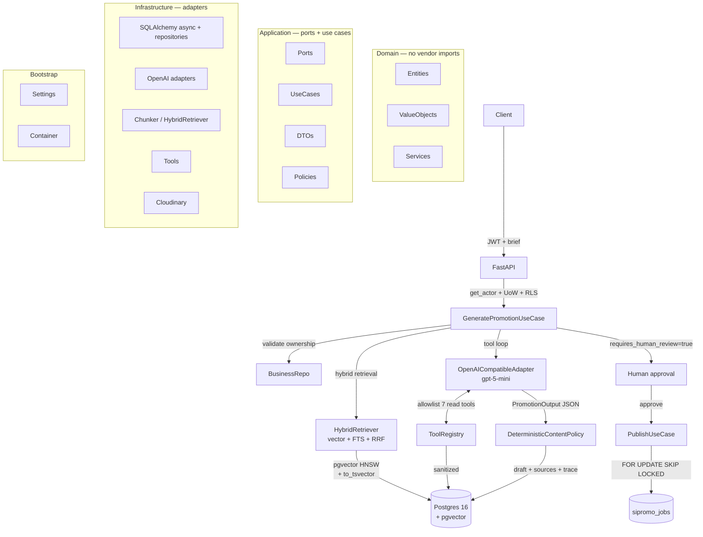

# Architecture

> Clean Architecture · SOLID · async I/O · Postgres + pgvector as the only stateful dependency.

Source of truth for product scope: [`ainov_rag_tool_calling_blueprint.md`](ainov_rag_tool_calling_blueprint.md) (Indonesian). This document maps the blueprint to the implemented layers and ADRs.

---

## 1. Overview



**Dependency rule:** `presentation → application → domain`; `infrastructure → application ports + domain`; `bootstrap → all` for wiring (`src/sipromo/bootstrap/container.py:47`). Domain never imports FastAPI, SQLAlchemy, OpenAI or Cloudinary.

---

## 2. Layer map

| Layer | Path | Responsibility | Depends on |
|---|---|---|---|
| `presentation` | `src/sipromo/presentation/api/` | HTTP, auth (`get_actor`), serialization, error envelope | `application` |
| `application` | `src/sipromo/application/` | Ports (protocols), use cases (`GeneratePromotion`, `IngestKnowledge`, `Revise`, `Approve`, `Publish`), DTOs, policies | `domain` |
| `domain` | `src/sipromo/domain/` | Entities (`KnowledgeDocument`, `PromotionContent`, `SourceEvidence`), value objects (`TenantId`, `PromotionBrief`, `Provenance`), services (`claim_policy`) | nothing |
| `infrastructure` | `src/sipromo/infrastructure/` | `db/` (models `legacy.py`/`new.py`, repositories), `ai/` (`openai_compatible_adapter.py`, `openai_embeddings_adapter.py`), `rag/` (`chunker.py`, `hybrid_retriever.py`), `storage/` (`cloudinary_adapter.py`), `tools/` (`registry.py`, `read_tools.py`) | `application` ports + `domain` |
| `bootstrap` | `src/sipromo/bootstrap/` | `settings.py` (env), `container.py` (manual DI) | all |

SOLID is enforced per blueprint §5.3: `PromotionOrchestrator` vs `Retriever` vs `GroundingValidator` vs `ContentRepository` (SRP), `LLMPort`/`EmbeddingPort`/`ObjectStoragePort` (OCP/LSP), split `ContentReadRepository`/`ContentWriteRepository` (ISP), use cases receive ports not `AsyncSession` (DIP).

---

## 3. Data flow — `POST /promotions/generate`

```
Client
  → FastAPI endpoint (src/sipromo/presentation/api/v1/promotions.py:52)
  → Authentication + tenant resolution (dependencies.py:22, set_config app.current_umkm_id)
  → GeneratePromotionUseCase.execute
    1. authorize actor + resolve tenant
    2. validate product ownership (business_repo)
    3. create generation_run(started)
    4. query rewriting for retrieval (embeddings)
    5. hybrid retrieval with tenant filters (retriever.retrieve)
    6. deterministic prefetch (profile/products/inventory…)
    7. OpenAI initial call with allowlisted tools
    8. tool loop: validate → authorize → execute → sanitize → append (≤5 rounds, ≤8 calls)
    9. structured final response (PromotionOutput)
    10. grounding + policy validation (DeterministicContentPolicy)
    11. persist content_asset + revision + sources atomically (UoW)
    12. complete generation_run
  → return draft + provenance + warnings (requires_human_review=true)
```

Degradation: RAG empty → warning + brief/tools only; product not found → `422`; out-of-stock → CTA softened; quota 429 → `503` (no retry in generation) — see [API Reference](api-reference.md#1-conventions).

---

## 4. Hybrid RAG

1. `embed_query` via `OpenAIEmbeddingAdapter` (`text-embedding-3-small`, `EMBEDDING_DIM=768`).
2. Vector search: `embedding <=> :query_embedding` cosine, `WHERE umkm_id = :umkm_id` (`knowledge_chunks` HNSW).
3. FTS: `to_tsvector('simple', content)` `@@ plainto_tsquery`.
4. Fusion: **RRF** `K=60`.
5. Metadata priority: `brand_guide(1.0) > campaign_example(0.8) > policy(0.6) > faq(0.4) > catalog(0.2)`.
6. Threshold `RAG_MIN_SCORE=0.55`; diversity `≤3 chunks / document`; final `RAG_FINAL_K=8`; token budget `RAG_MAX_CONTEXT_TOKENS=6000`.

No external vector store — Postgres only (ADR-002). Evaluation: `scripts/run_rag_evaluation.py`, report in [Evaluation](evaluation_report.md).

---

## 5. Tool policy

* **7 read tools** (model-callable): `get_business_profile`, `get_products`, `get_inventory_eligibility`, `get_market_summary`, `get_competitor_summary`, `get_sales_summary`, `search_brand_knowledge`.
* **Write tools** are **server-only**: `save_promotion_draft` returns `{"denied":true}` inside generation; `create_publish_job` only from `PublishContentUseCase`. Arguments Pydantic-validated, `umkm_id` injected from auth, output sanitized (`PRIVATE_FIELD_NAMES`) before entering model context (ADR-003).
* Budget: `AI_MAX_TOOL_ROUNDS=5` (settings default `6`), `AI_MAX_TOOL_CALLS=8` (default `16`) — enforced in loop.

---

## 6. Multi-tenancy

* Every row carries `umkm_id`; RLS `FORCE` on `knowledge_documents`, `knowledge_chunks`, `generation_runs`; UoW `set_config('app.current_umkm_id', ..., true)` + repository `WHERE umkm_id = :umkm_id` (ADR-004, defense-in-depth).
* Verified by integration suite under non-superuser role — leakage target `0`.

---

## 7. Persistence & versioning

* `content_assets` (legacy) is the canonical record — `id`, `umkm_id`, `title`, `content_type`, `prompt` (sanitized brief), `generated_text`, `caption`, `hashtags`, `tone`, `style`, `version`, `status=draft`.
* Additions: `knowledge_documents`/`knowledge_chunks` (vector 768), `generation_runs`/`generation_tool_calls`, `content_sources`, `content_revisions` (immutable history, `version` unique per content), `content_approvals`, `sipromo_jobs` (claim via `FOR UPDATE SKIP LOCKED`), `umkm_memberships`, `idempotency_keys`.
* See `src/sipromo/infrastructure/db/models/new.py` and `legacy.py`; Alembic `0001` introspects legacy so adoption is non-destructive (ADR-001).

---

## 8. Architecture Decision Records

### ADR-001: Model & provider abstraction with legacy-schema reconciliation

- **Status:** Accepted
- **Context:** SiPromo runs on a pre-existing Neon PostgreSQL schema (products, content_assets, umkm memberships). A fresh schema would break existing data.
- **Decision:** Map legacy tables read-only via `models/legacy.py` (no DDL from us); new tables live in `models/new.py`. Alembic `0001_legacy_baseline` detects pre-existing tables and no-ops; `0002`/`0003` add only the new knowledge/trace/queue/membership structures. `alembic check` confirms zero drift.
- **Consequence:** Adoption without destructive rebuild; legacy columns used by the app (e.g. `metadata`) are accessed via mapped names (`metadata_`).

### ADR-002: Hybrid RAG (vector + FTS + RRF)

- **Status:** Accepted
- **Context:** UMKM promotion copy needs both semantic recall and exact-match precision (brand terms, SKU codes, prices).
- **Decision:** pgvector HNSW (cosine) + Postgres FTS (`to_tsvector('simple', …)`) fused with Reciprocal Rank Fusion (`RRF_K=60`), then metadata-type priority (brand guide > campaign example > policy > faq > catalog), minimum score threshold, diversity (≤3 chunks/document) and a token budget.
- **Consequence:** Deterministic, DB-only retrieval; no external vector store.

### ADR-003: Tool policy — read-only by default, single guarded write

- **Status:** Accepted
- **Context:** A model with write tools can cause damage; every tool payload reaches the model context.
- **Decision:** 7 read tools (profile, products, inventory, market, competitors, sales, knowledge search) + `save_promotion_draft` (returns `{"denied": true}` in generation; drafts are written by the use case, not the model). `create_publish_job` is application-only. Arguments are Pydantic-validated, `umkm_id` injected from auth, and output recursively sanitized (private field names stripped) before entering model context.
- **Consequence:** Model cannot persist state directly; all writes are server-initiated and traceable.

### ADR-004: Multi-tenancy with RLS defense-in-depth

- **Status:** Accepted
- **Context:** Multiple UMKM share one database; a tenant must never see another tenant's data.
- **Decision:** Every table carries `umkm_id`; RLS is FORCE-enabled on `knowledge_documents`, `knowledge_chunks`, `generation_runs`. Each unit of work sets `app.current_umkm_id` via `set_config(..., true)`; repositories additionally filter by `umkm_id` in every query. Integration tests verify leakage is zero under a non-superuser role.
- **Consequence:** Two independent barriers; a repo bug cannot leak across tenants even if RLS were bypassed.

### ADR-005: Queue — `sipromo_jobs` claimed rows, no broker

- **Status:** Accepted
- **Context:** Publish/approval work must be durable and exactly-once without adding a message broker to the deployment.
- **Decision:** Jobs table with claim semantics (`claim_job` picks an available row atomically via `FOR UPDATE SKIP LOCKED`), status enum, retry counts and `expires_at`. Idempotency keys keyed by scope + request hash with TTL for exactly-once API semantics.
- **Consequence:** Single Postgres dependency; horizontal workers safe via skip-locked claiming.

### ADR-006: Approval flow — generation never auto-publishes

- **Status:** Accepted
- **Context:** Promotion copy goes live to public channels; unvalidated AI output must not be published.
- **Decision:** Pipeline is generate → human approval → publish. The content policy (`requires_human_review`) is always `True`; approvals are recorded with actor and timestamp; publish claims the job and marks it done.
- **Consequence:** Publishing requires an authenticated owner action; the audit trail supports compliance.

---

## 9. References

* Blueprint: `docs/ainov_rag_tool_calling_blueprint.md` §§4–8, 12–13
* Code: `src/sipromo/domain/`, `src/sipromo/application/`, `src/sipromo/infrastructure/`, `src/main.py:1`
* Migrations: `migrations/versions/`
* Evaluation & security: [Evaluation](evaluation_report.md), [Threat Model](threat_model.md)
