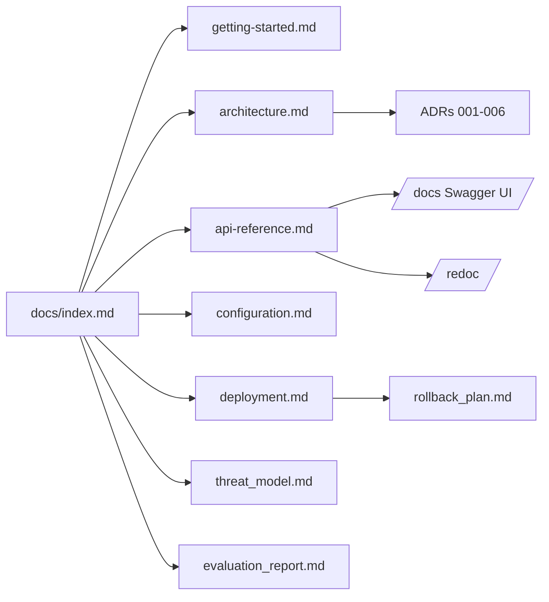

# SiPromo — Documentation

> **Contextual Promotion Generation for UMKM (SMEs)**
> RAG + tool-calling + human approval · FastAPI · PostgreSQL + pgvector · OpenAI · Cloudinary

[](../LICENSE)
[](../pyproject.toml)
[](../src/main.py)
[](../pyproject.toml)

---

## What is SiPromo?

SiPromo helps Indonesian UMKM generate **promotion copy that is grounded in their own data**, not hallucinated.

Every generation:

1. Validates the brief and tenant ownership.
2. Retrieves narrative context via **hybrid RAG** (pgvector HNSW + Postgres FTS + RRF).
3. Calls **7 allowlisted read tools** for structured facts (profile, products, stock, market, competitors, sales, knowledge search).
4. Runs an **OpenAI tool loop** (max 5 rounds / 8 calls) to assemble a `PromotionOutput`.
5. Validates claims deterministically and persists **draft + sources + trace + revision**.
6. Requires **human approval** before creating a publish job.

No free-form SQL for the model, no auto-publish, no cross-tenant leakage.

Blueprint and product rationale: [`ainov_rag_tool_calling_blueprint.md`](ainov_rag_tool_calling_blueprint.md) (Indonesian, normative).

---

## Quick links

| I want to… | Go to |
|---|---|
| Run the service locally | [Getting Started](getting-started.md) |
| Understand the architecture | [Architecture](architecture.md) |
| Call the API | [API Reference](api-reference.md) · **Live docs:** [`/docs`](/docs) · [`/redoc`](/redoc) · [`/openapi.json`](/openapi.json) |
| Configure environment | [Configuration](configuration.md) |
| Deploy / roll back | [Deployment](deployment.md) + [Rollback Plan](rollback_plan.md) |
| Evaluate RAG quality | [Evaluation Report](evaluation_report.md) |
| Review security | [Threat Model](threat_model.md) |

---

## Repository layout

```
src/
  main.py                          # FastAPI factory (create_app) — OpenAPI at /docs
  sipromo/
    domain/                        # Entities, value objects, domain services (no vendor imports)
    application/                   # Ports, use cases, DTOs, policies
    infrastructure/                # DB, OpenAI, Cloudinary, RAG, tools adapters
    presentation/                  # HTTP API + auth + exception envelope
    bootstrap/                     # Settings + DI container
migrations/                        # Alembic (0001 legacy no-op → 0003)
tests/                             # unit + integration (testcontainers pgvector)
scripts/                           # seed ingest + RAG evaluation
docs/                              # you are here
```

---

## Documentation map



---

## Conventions

* **Language:** code and API docs in English; product blueprint in Indonesian (source of truth for product decisions).
* **Tenant model:** `umkm_id` is always taken from the JWT — never from the request body or the model.
* **Error envelope:** every error returns `{ "error": { "code", "message", "request_id", "details"? } }` with `X-Request-ID`.
* **Versioning:** API versioned via `API_V1_PREFIX=/api/v1`; DB via Alembic.

---

## Support

* Health: `GET /api/v1/health/live` (no auth), `GET /api/v1/health/ready`, `GET /api/v1/health/dependencies` (owner).
* Logs: structured (structlog) + OpenTelemetry trace; never log secrets.
* Issues: https://github.com/anomalyco/opencode/issues
